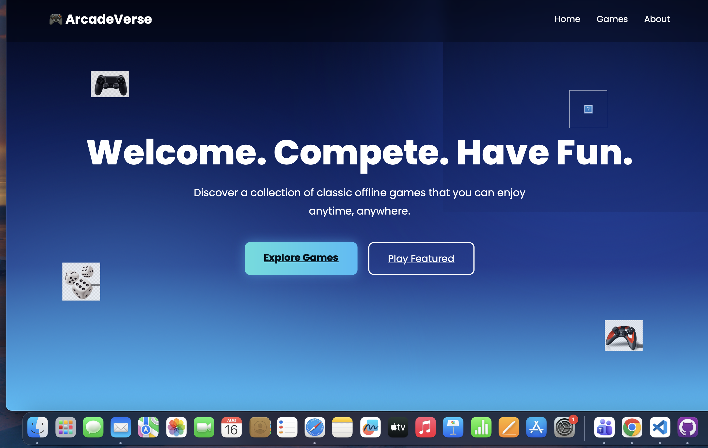

# 🎮 ArcadeVerse

ArcadeVerse is an offline-friendly arcade website featuring multiple classic games built using HTML, CSS, and JavaScript.

## 🎯 Games

- 🎯 Tic-Tac-Toe
- 🐍 Snake
- 🧠 Memory
- ✊ Rock Paper Scissors
- 🔢 2048

## 🛠️ Technologies Used

- HTML5
- CSS3
- JavaScript
- HTML Canvas
- Local Storage

## 🚀 How to Play

Visit the live ArcadeVerse website and choose a game from the **Games** section.

No installation is required.

## 📂 Project Structure

```text
ArcadeVerse/
│
├── css/
├── games/
├── images/
├── js/
├── sounds/
├── index.html
└── README.md
```

## 📸 Screenshots

### 🏠 Homepage




## 🌐 Live Website

[🎮 Play ArcadeVerse](https://ruchaakadam.github.io/ArcadeVerse/)

## 👩‍💻 Author

**Rucha Kadam**

- GitHub: https://github.com/ruchaakadam
- LinkedIn: https://www.linkedin.com/in/ruchaakadam
- Email: ruchaakadam.17@gmail.com
